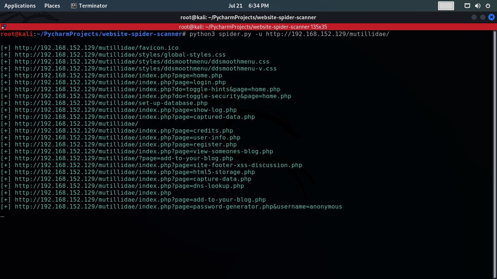

# Website Spider Scanner
The "Website Spider Scanner" is a Python script that crawls through a target website and extracts all the links it can find. It then recursively follows each link to extract more links, creating a spider-like structure. The script is designed to scan websites and display all the discovered links on the console.

## Requirements
Before running the script, make sure you have the following installed:
- Python 3x
- Requests library: You can install it using pip: `pip install requests`
- Colorama library: You can install it using pip: `pip install colorama`

## Usage
To use the **"Website Spider Scanner,"** follow these steps:
1. Clone or download the script to your local machine.
2. Open a terminal or command prompt and navigate to the directory where the script is located.
3. Run the script using the following command:
    ```commandline
    python3 spider.py -u <target_url>
    ```
4. Replace <target_url> with the URL of the website you want to scan.

## Options
The script accepts the following option:
- `-u`, `--url`: Specify the URL of the target website you want to scan. Make sure to include the protocol (e.g., https://) in the URL.

## Output
- The script will start scanning the target website and its linked pages. It will display all the discovered links on the console, starting from the provided target URL and recursively following each link found.
- The links will be printed in green to easily distinguish them from other output.

## Screenshots


## Notes
- The script utilizes requests library to make HTTP requests and re (regular expressions) to extract links from the HTML content.
- The scanning process is recursive, meaning it will follow each link to discover more links until it exhausts all possibilities or the user interrupts the program using `ctrl + c`.
- If an invalid URL or connection error is encountered for a particular link, the script will gracefully handle the error and continue scanning other links.

## Disclaimer
This script is intended for educational and ethical use only. You should have permission to scan and access the target website. Unauthorized scanning of websites may violate the law and can lead to legal consequences. Use it responsibly and at your own risk.

## Author
The "Website Spider Scanner" script was developed by **Saher Muhamed**.
